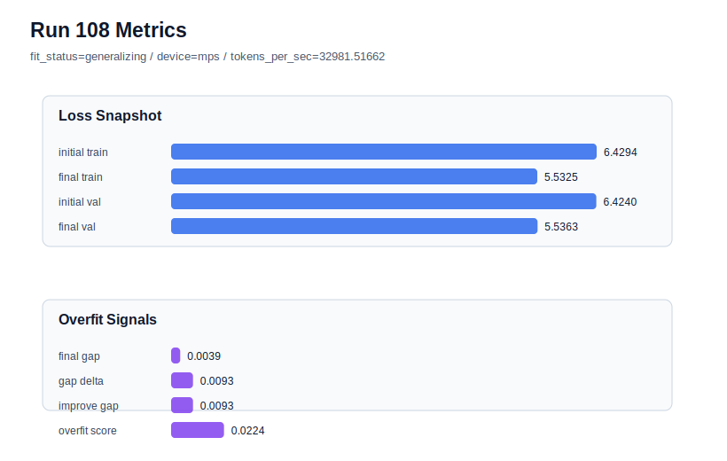

# run 108 실험 보고서

## 이번 가설

A fresh seed808 run with the promoted mish stride24 max_steps100 candidate will show whether seed707 is an outlier overfit case or whether the new 100-step default has a broader fresh-seed variance problem.

## 왜 이 가설을 세웠는가

Runs101-103 made max_steps100 the leading default candidate: seed606 improved raw validation, seed151 became the overfit-aware best, and seed202 stayed low-risk with the strongest raw validation. Seed707 then exposed a high-gap failure at stride24 in run104, and run107 showed that shortening stride24 to max_steps95 still overfits. The matched-architecture stride20 rescue in run106 reduced seed707's gap and overfit_score, but at a small validation cost. The next highest-information step is therefore seed variance, not another seed707 tweak: keep architecture, activation, stride, regularization, optimizer, and max_steps100 fixed, and test a new fresh seed to decide whether stride20 should remain a targeted rescue or become a more central policy.

## 가설 작성 주체

llm_plan:docs/train/next_plan.json

## 바꾼 변수

```json
{
  "seed": 808,
  "max_steps": 100
}
```

## 고정한 변수

vocab_size, context_length, stride, batch_size, learning_rate, weight_decay, grad_clip, emb_dim, n_heads, n_layers, drop_rate, qkv_bias, ffn_mult, norm_first, norm_eps, activation_name, ffn_dropout_position, attention_impl, tie_embeddings, init_std

## 기대 결과

If seed707 is mostly an outlier, seed808 should finish generalizing with final_val_loss in the 5.53-5.55 band, final_generalization_gap below 0.03, and overfit_score below 0.10. If seed808 also shows high gap or overfit_score above 0.15, the 100-step stride24 default has a broader fresh-seed overfit issue and stride20 rescue should be tested immediately on the same seed.

## 실험 설정

```json
{
  "run_id": 108,
  "hypothesis": "A fresh seed808 run with the promoted mish stride24 max_steps100 candidate will show whether seed707 is an outlier overfit case or whether the new 100-step default has a broader fresh-seed variance problem.",
  "seed": 808,
  "vocab_size": 600,
  "min_frequency": 2,
  "context_length": 48,
  "stride": 24,
  "batch_size": 8,
  "max_steps": 100,
  "eval_batches": 4,
  "train_ratio": 0.9,
  "learning_rate": 0.0003,
  "weight_decay": 0.01,
  "grad_clip": 1.0,
  "emb_dim": 128,
  "n_heads": 4,
  "n_layers": 2,
  "drop_rate": 0.12,
  "qkv_bias": false,
  "ffn_mult": 3,
  "norm_first": false,
  "norm_eps": 1e-05,
  "activation_name": "mish",
  "ffn_dropout_position": "none",
  "attention_impl": "sdpa",
  "tie_embeddings": true,
  "init_std": 0.02
}
```

## 실행 환경

```json
{
  "timestamp": "2026-06-03T04:09:09+00:00",
  "hostname": "woonyong-MacBookPro.local",
  "platform": "macOS-26.3.1-arm64-arm-64bit-Mach-O",
  "machine": "arm64",
  "python": "3.13.13",
  "torch": "2.12.0",
  "cpu_count": 10,
  "memory_gb": 24.0,
  "cuda_available": false,
  "cuda_device_count": 0,
  "mps_available": true,
  "resolved_device": "mps",
  "profile": "mps_balanced"
}
```

- corpus: `src/learning/the-verdict.txt`
- artifact_dir: `docs/train/runs/run_108_artifacts`

## 실제 결과

| 지표 | 값 |
| --- | --- |
| initial_train_loss | 6.429391622543335 |
| initial_val_loss | 6.423993269602458 |
| final_train_loss | 5.532469153404236 |
| final_val_loss | 5.536325136820476 |
| final_generalization_gap | 0.0038559834162397166 |
| generalization_gap_delta | 0.0092543363571167 |
| train_val_improvement_gap | 0.0092543363571167 |
| overfit_score | 0.022364656130473115 |
| fit_status | generalizing |
| parameter_count | 413184 |
| tokens_per_sec | 32981.51661970901 |
| elapsed_sec | 1.1584670420270413 |
| device | mps |

## 시각 지표




- 대시보드: `../dashboard.md`
- 지표 요약 CSV: `../metrics_summary.csv`

## 과적합 판단

일반화 개선 신호. final gap=0.0039, overfit_score=0.0224. seed 반복으로 재현성을 확인할 만하다.

## 결론

현재 best 후보: run 102 / val=5.534507115681966 / status=generalizing

## 다음 실험 제안

- 성공 시: If seed808 is low-risk, preserve mish stride24 max_steps100 as the default for low-risk seeds, document seed707 as a rescue case, and consider one more fresh seed only if confidence remains unclear.
- 과적합 시: If seed808 overfits, keep seed808 fixed and test stride20 under the same 413184-parameter mish max_steps100 configuration before changing activation, capacity, learning rate, or regularization.
