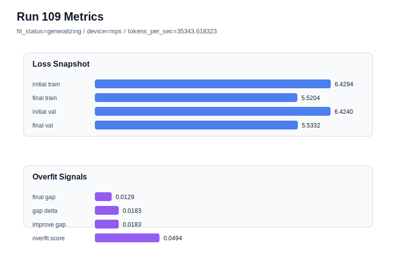

# run 109 실험 보고서

## 이번 가설

For the low-risk fresh seed808 mish stride24 candidate, increasing max_steps from 100 to 105 will test whether low-gap seeds remain mildly optimization-limited and can improve validation without entering the seed707-style overfit regime.

## 왜 이 가설을 세웠는가

Run108 showed that the promoted mish stride24 max_steps100 default generalizes on a fresh seed808 with final_val_loss=5.536325, final_generalization_gap=0.003856, train_val_improvement_gap=0.009254, and overfit_score=0.022365. This supports treating seed707 as a targeted rescue case, but run108 is still only slightly behind the overfit-aware best run102 (final_val_loss=5.534507). Because seed808's gap and overfit score are low, a tiny +5 step optimization probe is a safer and higher-information next test than changing activation, capacity, regularization, or stride. The run remains hardware-light on MPS and explicitly preserves the 413184-parameter Transformer configuration.

## 가설 작성 주체

llm_plan:docs/train/next_plan.json

## 바꾼 변수

```json
{
  "seed": 808,
  "max_steps": 105
}
```

## 고정한 변수

vocab_size, context_length, stride, batch_size, learning_rate, weight_decay, grad_clip, emb_dim, n_heads, n_layers, drop_rate, qkv_bias, ffn_mult, norm_first, norm_eps, activation_name, ffn_dropout_position, attention_impl, tie_embeddings, init_std

## 기대 결과

If seed808 is still mildly optimization-limited, max_steps105 should lower final_val_loss below run108's 5.536325, ideally near or below run102's 5.534507, while keeping final_generalization_gap below 0.02 and overfit_score below 0.08. If train loss improves but validation stalls or overfit_score rises above 0.10, max_steps100 should remain the low-risk default horizon.

## 실험 설정

```json
{
  "run_id": 109,
  "hypothesis": "For the low-risk fresh seed808 mish stride24 candidate, increasing max_steps from 100 to 105 will test whether low-gap seeds remain mildly optimization-limited and can improve validation without entering the seed707-style overfit regime.",
  "seed": 808,
  "vocab_size": 600,
  "min_frequency": 2,
  "context_length": 48,
  "stride": 24,
  "batch_size": 8,
  "max_steps": 105,
  "eval_batches": 4,
  "train_ratio": 0.9,
  "learning_rate": 0.0003,
  "weight_decay": 0.01,
  "grad_clip": 1.0,
  "emb_dim": 128,
  "n_heads": 4,
  "n_layers": 2,
  "drop_rate": 0.12,
  "qkv_bias": false,
  "ffn_mult": 3,
  "norm_first": false,
  "norm_eps": 1e-05,
  "activation_name": "mish",
  "ffn_dropout_position": "none",
  "attention_impl": "sdpa",
  "tie_embeddings": true,
  "init_std": 0.02
}
```

## 실행 환경

```json
{
  "timestamp": "2026-06-03T04:14:28+00:00",
  "hostname": "woonyong-MacBookPro.local",
  "platform": "macOS-26.3.1-arm64-arm-64bit-Mach-O",
  "machine": "arm64",
  "python": "3.13.13",
  "torch": "2.12.0",
  "cpu_count": 10,
  "memory_gb": 24.0,
  "cuda_available": false,
  "cuda_device_count": 0,
  "mps_available": true,
  "resolved_device": "mps",
  "profile": "mps_balanced"
}
```

- corpus: `src/learning/the-verdict.txt`
- artifact_dir: `docs/train/runs/run_109_artifacts`

## 실제 결과

| 지표 | 값 |
| --- | --- |
| initial_train_loss | 6.429391622543335 |
| initial_val_loss | 6.423993269602458 |
| final_train_loss | 5.520353317260742 |
| final_val_loss | 5.533207734425862 |
| final_generalization_gap | 0.012854417165120147 |
| generalization_gap_delta | 0.01825277010599713 |
| train_val_improvement_gap | 0.01825277010599713 |
| overfit_score | 0.049359957377114405 |
| fit_status | generalizing |
| parameter_count | 413184 |
| tokens_per_sec | 35343.61832304314 |
| elapsed_sec | 1.1353676251601428 |
| device | mps |

## 시각 지표




- 대시보드: `../dashboard.md`
- 지표 요약 CSV: `../metrics_summary.csv`

## 과적합 판단

일반화 개선 신호. final gap=0.0129, overfit_score=0.0494. seed 반복으로 재현성을 확인할 만하다.

## 결론

현재 best 후보: run 102 / val=5.534507115681966 / status=generalizing

## 다음 실험 제안

- 성공 시: If max_steps105 improves seed808 without medium-risk overfit, test the same 105-step horizon on seed151 or seed202 before considering it as a low-risk-seed refinement.
- 과적합 시: If max_steps105 overfits or worsens validation, keep mish stride24 max_steps100 as the default and reserve stride20 only for high-gap rescue cases such as seed707.
